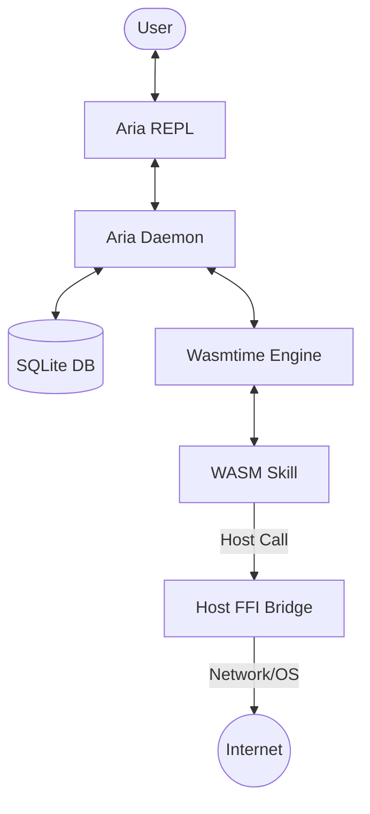
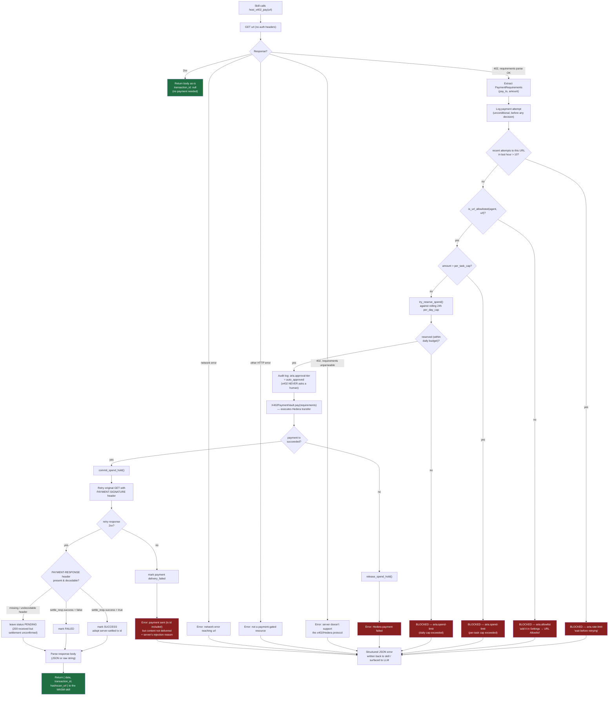
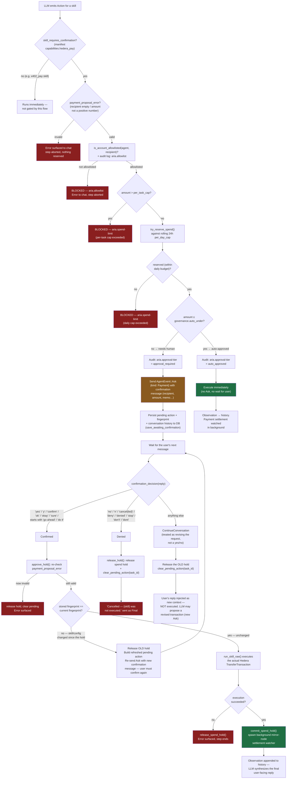

# ARIA Architecture

ARIA (Agentic Interface for AI) is a modular, high-performance host system designed to execute AI "skills" in a highly secure, sandboxed environment using WebAssembly (WASM).

## System Overview

The system is split into two primary domains: the **Host (Aria Daemon)** and **Guest (WASM Skills)**.

## Core Components

### 1. Aria Daemon (`aria-daemon`)
Written in Rust, the daemon is the central nervous system of ARIA. It manages:
- **Skill Lifecycle**: Loading, caching, and executing WASM modules.
- **State Management**: Persistent storage via SQLite for configuration and skill-specific data.
- **Async Runtime**: Leveraging `tokio` for concurrent task management, while offloading synchronous WASM execution to dedicated threads via `spawn_blocking`.

### 2. WASM Skill System
Skills are standalone WASM binaries (compiled for `wasm32-wasip1`) that perform specific tasks (e.g., search, scraping).
- **Self-Describing**: Each skill includes a `manifest.toml` defining its capabilities, configurations, and display templates.
- **Isolation**: Skills have zero access to the host filesystem or network unless explicitly granted via Host FFI functions.

### 3. Host-Guest Communication Protocol
Communication occurs over linear memory using a specialized JSON-based protocol.

#### Memory Layout
- **Input Buffer (Offset 0)**: The host writes the execution arguments as a UTF-8 JSON string starting at offset 0.
- **Dynamic Output Allocation**: When a skill triggers a host function (like `host_http_get`), the host:
    1. Determines the current end of the WASM linear memory (`memory.data_size()`).
    2. Grows the memory by the required size of the response.
    3. Writes the response payload at the previous boundary point.
    4. Returns the pointer to the guest.
- **Null-Termination**: All strings passed between host and guest are null-terminated (C-string style) to ensure compatibility across different guest languages.

## Security Model

ARIA follows the principle of least privilege:
- **Capabilities**: Skills must declare requirements (like `http`) in their manifest. The host only wires functions matching these declarations.
- **Resource Limits**: The host enforces execution timeouts and maximum response sizes (e.g., 5MB for HTTP results) to prevent resource exhaustion.
- **Memory Safety**: By appending responses to the end of memory and growing the heap, the host avoids colliding with the guest's internal allocator.

## Payment Flows

ARIA supports two distinct payment paths, gated by different governance mechanisms. Both are backed by the same allowlist / spend-cap / audit machinery in `src/payments/`, but only one of them ever asks a human.

### x402 — autonomous payment (`host_x402_pay`)

A WASM skill hits a resource, gets an HTTP 402, and ARIA pays for it **without asking a human** — governance (rate limit, URL allowlist, per-task cap, per-day cap) runs synchronously inside the host call itself, right after the 402 response reveals `pay_to` / `amount`. See `src/skills/wasm_runtime.rs` (`wire_x402_pay`).

**Notes:** rate limiting and the allowlist are keyed on the request **URL**, not the payout account (`pay_to`), since one payout account can serve many distinct resources. Settlement is server-attested via the signed `PAYMENT-RESPONSE` header — if it's missing, ARIA leaves the payment `PENDING` rather than assuming success.

### Direct transfer — human confirm/deny (`hedera_pay`)

A skill with the `hedera_pay` capability can move money directly, so it **must not fire without an explicit human "yes."** Governance runs once at proposal time, then the agent parks the pending action and waits for the user to confirm or deny. See `src/agent/react_loop.rs` (`approve_hold`, `release_hold`).

**Notes:** the `auto_under` threshold lets small payments skip human confirmation entirely while still passing through the same allowlist/cap checks. Approve/deny matching is deterministic (`confirmation_decision`), not re-interpreted by the LLM, so a reply at the moment money would move can't be reframed by the model. A **fingerprint** (hash of skill + args + execution context + skill/wasm artifact hashes) guards against a stale "yes" executing a transaction that changed after the confirmation was issued — a mismatch releases the old hold and re-asks instead of executing silently.

## Key Technologies
- **Execution**: [Wasmtime](https://wasmtime.dev/)
- **Runtime**: [Tokio](https://tokio.rs/)
- **Storage**: SQLite
- **Serialization**: Serde (JSON)
