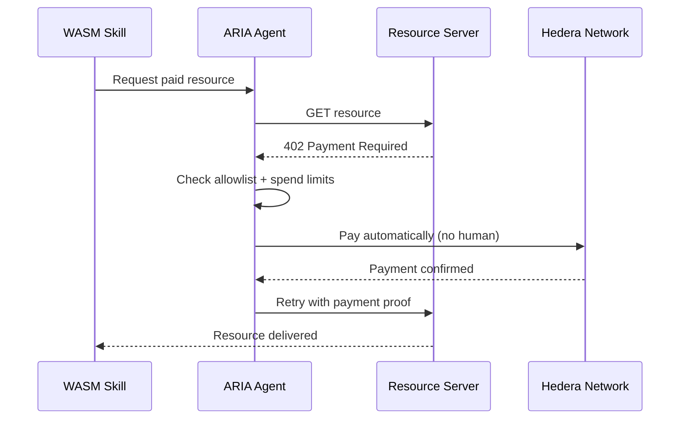
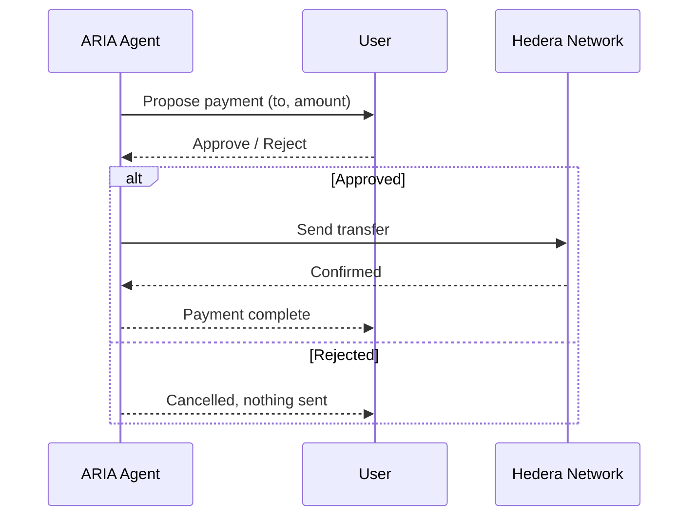

# ARIA Daemon (`aria-daemon`)

The ARIA Daemon is the core host component of the **Agentic Interface for AI (ARIA)** system. Structured as a modular, high-performance host, the daemon is responsible for managing AI operations, coordinating the `tokio` async runtime, interacting with persistent storage via SQLite, and securely executing AI "skills" through WebAssembly (WASM).

ARIA can also act autonomously with money — paying for gated resources over **x402 on Hedera** without human involvement, while every payment decision (allowed or blocked) is written to Hedera Consensus Service for audit.

> Architecture details (memory layout, host-guest protocol, governance internals) live in [`ARCHITECTURE.md`](./ARCHITECTURE.md). This README covers what ARIA does and how to run it.

## Live on Testnet

- **x402 autonomous payment** (agent paid for a gated resource, no human involved): [HashScan tx](https://hashscan.io/testnet/transaction/0.0.7162784@1785413926.629980177)
- **Direct transfer** (human-approved payment): [HashScan tx](https://hashscan.io/testnet/transaction/0.0.8859309@1785414520.775838958)
- **HCS decision audit trail** (every allow/deny decision, not just the payment itself): Topic `0.0.9742659`

## Features

- **WASM Skill Engine**: Leveraging the `wasmtime` engine, the daemon executes self-describing, isolated WASM skills (such as `search.web`, `read.fs`, `scrape.web`) within heavily sandboxed, linear memory boundaries.
- **Governed Payments on Hedera**: Two payment paths — autonomous `x402` payments gated by allowlist/rate-limit/spend-cap checks, and direct transfers that require explicit human confirmation. Every decision is logged to HCS. See [Payment Flows](#payment-flows) below for the simplified diagrams, and [`ARCHITECTURE.md`](./ARCHITECTURE.md#payment-flows) for the full governance flowcharts.
- **LLM Provider Support**: Flexible configuration routes AI inference natively handling both **Ollama** (`http://localhost:11434`) and **OpenRouter** APIs.
- **SQLite Persistence**: Maintains crucial connection configurations and runtime data seamlessly by wrapping local SQLite bindings for immediate local access.
- **Headless Runtime & Auto-Start**: Includes native CLI options to install and run itself as a headless background `systemd` user service across Linux environments.
- **Real `did:hedera` Identity**: On first startup ARIA mints a real on-chain DID. Its root/verification key is a fresh Ed25519 keypair generated locally by ARIA (`~/.aria/id.key`, encrypted at rest); a user-supplied ECDSA Hedera account (env var or interactive prompt) only pays the HCS topic-creation fee and later funds x402/direct payments. Signing runs through a pluggable trait-based `IdentityVault` HAL, paving the way for TPM and cloud-hosted hardware keys.
- **Task Chaining & Auditing**: Cryptographically hashes and links execution steps (using the Identity HAL) to maintain a verifiable audit trail of AI actions in SQLite.

## Identity & First-Run Bootstrap

ARIA's agent identity is a real `did:hedera` DID anchored on Hedera Consensus Service, created via [`hiero-did-sdk-rs`](https://github.com/hiero-hackers/hiero-did-sdk-rs). It is built on two keys with distinct roles:

| Key | Type | Role |
| --- | --- | --- |
| `~/.aria/id.key` | Ed25519, **generated by ARIA on first run** | The DID's root/verification key. Signs audit-log and task-chain entries via the Identity HAL. Encrypted at rest with AES-256-GCM keyed on the device secret + DID string. The user never sees or touches it. |
| ECDSA operator key | secp256k1, **user-supplied** | The Hedera operator: pays HCS gas (DID creation) and funds x402 / direct-transfer payments. Read from `HEDERA_ACCOUNT_ID` + `HEDERA_PRIVATE_KEY`. ARIA never generates it. |

**First startup** — if no identity row exists in the SQLite `identity` table, ARIA:

1. Reads the ECDSA operator credentials from the environment, or prompts for them on a terminal.
2. Generates a fresh Ed25519 keypair internally — this becomes `id.key`, the DID root key.
3. Uses the ECDSA account as the Hedera client operator to pay the HCS topic-creation fee.
4. Registers the DID on-chain via `hiero-did-registrar` (with ARIA's Ed25519 key as the DID root key) and stores the DID + public key in the `identity` table.

There are no stub DIDs (`did:aria:jayesh` is gone from the startup path). If no identity exists and no operator credentials are available, the daemon **fails with a clear, actionable message** — create a funded testnet account at https://portal.hedera.com/ and set `HEDERA_ACCOUNT_ID` / `HEDERA_PRIVATE_KEY`, or run `aria daemon` interactively so it can prompt you.

Environment variables:

- `HEDERA_ACCOUNT_ID` — operator account, e.g. `0.0.12345`
- `HEDERA_PRIVATE_KEY` — operator ECDSA (secp256k1) private key
- `HEDERA_NETWORK` — `testnet` (default) | `mainnet` | `previewnet`

## Payment Flows

ARIA supports two payment paths: one fully autonomous, one that requires human approval. Full governance detail (rate limits, allowlist, spend caps, settlement states) is in [`ARCHITECTURE.md`](./ARCHITECTURE.md#payment-flows) — these are the simplified versions.

### x402 — autonomous payment

The agent hits a paywalled resource and pays for it automatically, after checking it's allowed to.



### Direct transfer — human confirm/deny

The agent proposes a payment and waits for the user to approve or reject it before sending anything.



## Core Commands

The `aria-daemon` executable provides the following primary CLI commands:

- `aria` or `aria daemon` - Run the headless TCP service (default).
- `aria install` - Installs the daemon as an auto-starting systemd user service (`~/.config/systemd/user/aria-daemon.service`).
- `aria help` - Print usage and exit.

## TCP API Endpoint

When running as a daemon, ARIA exposes a headless TCP endpoint on **`127.0.0.1:5005`**. External clients can communicate with the daemon by sending a JSON request and listening for a stream of JSON-encoded agent events.

**Request Format:**
```json
{
  "task": "Your task description here",
  "type": "optional_skill_type"
}
```

**Response Format:**
The daemon will subsequently stream back execution events (such as `Action`, `Observation`, and `Error`) formatted as JSON lines, detailing the steps the agent is taking to resolve the task.

## Project Structure

- `src/main.rs`: Entry point defining the main process bootstrap, SQLite initializing, and handling subcommands (Daemon, Install). Builds the shared Hedera client once and passes it to the identity bootstrap and both payment vaults.
- `src/agent/`: Core LLM integration and the prompt/ReAct interaction loop bridging user goals with available features.
- `src/config.rs`: Centralized runtime configuration defining URL mappings, target models, and injecting manifest constants into dynamic host environments.
- `src/crypto.rs`: Ed25519 key generation, AES-256-GCM at-rest encryption, multibase encoding, and the real `did:hedera` identity bootstrap (`create_real_identity`).
- `src/db.rs`: Interacting directly with the SQLite datastore configurations, task chains, and identities.
- `src/fee_payer.rs`: Abstraction over who pays Hedera transaction fees for DID operations — the local ECDSA operator today, a relay server in the future.
- `src/identity/`: Hardware Abstraction Layer (HAL) for securely managing identity vaults and signing.
- `src/payments/`: Allowlist, spend-cap, and audit-log governance shared by both payment paths.
- `src/skills/`: Managing WASM modules, loading skills from `skills/`, parsing `.toml` manifests, enforcing memory offsets, and executing sandbox instructions.

See [`ARCHITECTURE.md`](./ARCHITECTURE.md) for the full system diagram, payment governance flowcharts, and host-guest memory protocol.

## Development & Building

The Daemon relies on its workspace configuration located at `../Cargo.toml`. To build:

```bash
cargo build -p aria-daemon
```

To run directly via cargo:

```bash
cargo run -p aria-daemon
```

```bash
cargo build -p read_fs --target wasm32-wasip1 --release
```