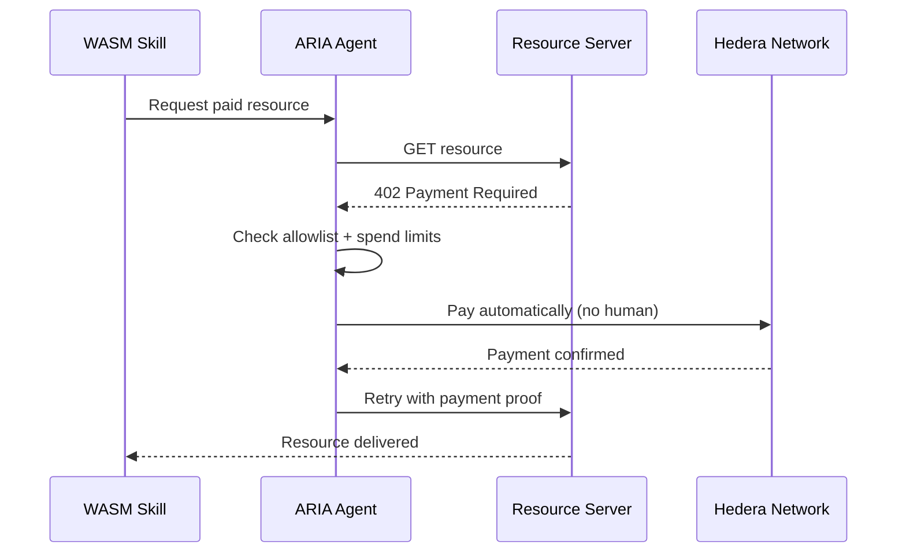
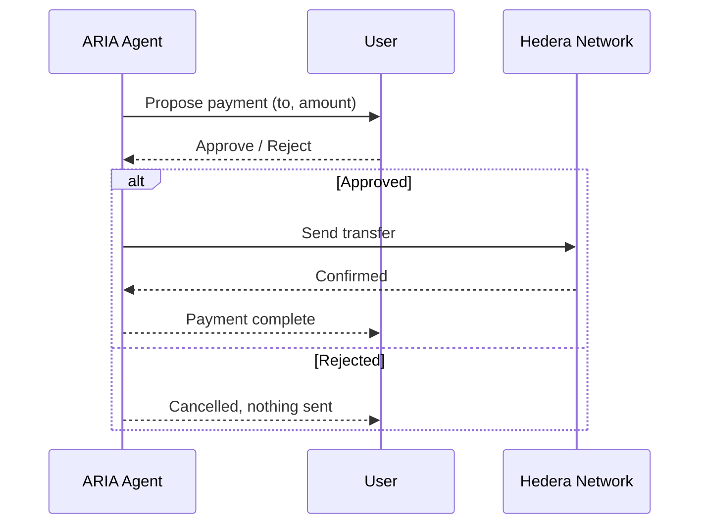

# ARIA Daemon (`aria-daemon`)

The ARIA Daemon is the core host component of the **Agentic Interface for AI (ARIA)** system. Structured as a modular, high-performance host, the daemon is responsible for managing AI operations, coordinating the `tokio` async runtime, interacting with persistent storage via SQLite, and securely executing AI "skills" through WebAssembly (WASM).

## Features

- **WASM Skill Engine**: Leveraging the `wasmtime` engine, the daemon executes self-describing, isolated WASM skills (such as `search.web`, `read.fs`, `scrape.web`) within heavily sandboxed, linear memory boundaries. 
- **LLM Provider Support**: Flexible configuration routes AI inference natively handling both **Ollama** (`http://localhost:11434`) and **OpenRouter** APIs. 
- **SQLite Persistence**: Maintains crucial connection configurations and runtime data seamlessly by wrapping local SQLite bindings for immediate local access.
- **Headless Runtime & Auto-Start**: Includes native CLI options to install and run itself as a headless background `systemd` user service across Linux environments.
- **Secure Identity HAL**: Pluggable trait-based `IdentityVault` for cryptographic operations, paving the way for TPM and cloud-hosted hardware signing.
- **Task Chaining & Auditing**: Cryptographically hashes and links execution steps (using the Identity HAL) to maintain a verifiable audit trail of AI actions in SQLite.

## Core Commands

The `aria-daemon` executable provides the following primary CLI commands:

- `aria` or `aria daemon` - Run the headless TCP service (default).
- `aria install` - Installs the daemon as an auto-starting systemd user service (`~/.config/systemd/user/aria-daemon.service`).
- `aria help` - Print usage and exit.

## TCP API Endpoint

When running as a daemon, ARIA exposes a headless TCP endpoint on **`127.0.0.1:5005`**. External clients can communicate with the daemon by sending a JSON request and listening for a stream of JSON-encoded agent events.

**Request Format:**
```json
{
  "task": "Your task description here",
  "Type": "optional_skill_type"
}
```

**Response Format:**
The daemon will subsequently stream back execution events (such as `Action`, `Observation`, and `Error`) formatted as JSON lines, detailing the steps the agent is taking to resolve the task.

## Project Structure

- `src/main.rs`: Entry point defining the main process bootstrap, SQLite initializing, and handling subcommands (Daemon, Install).
- `src/agent/`: Core LLM integration and the prompt/ReAct interaction loop bridging user goals with available features.
- `src/config.rs`: Centralized runtime configuration defining URL mappings, target models, and injecting manifest constants into dynamic host environments.
- `src/crypto.rs`: Cryptographic utilities for hashing and validating the execution task chain.
- `src/db.rs`: Interacting directly with the SQLite datastore configurations, task chains, and identities.
- `src/identity/`: Hardware Abstraction Layer (HAL) for securely managing identity vaults and signing.
- `src/skills/`: Managing WASM modules, loading skills from `skills/`, parsing `.toml` manifests, enforcing memory offsets, and executing sandbox instructions.

## Payment Flows

ARIA supports two payment paths: one fully autonomous, one that requires human approval.

### x402 — autonomous payment

The agent hits a paywalled resource and pays for it automatically, after checking it's allowed to.



### Direct transfer — human confirm/deny

The agent proposes a payment and waits for the user to approve or reject it before sending anything.


## Development & Building

The Daemon relies on its workspace configuration located at `../Cargo.toml`. To build:

```bash
cargo build -p aria-daemon
```

To run directly via cargo:

```bash
cargo run -p aria-daemon
```

cargo build -p read_fs --target wasm32-wasip1 --release

## Security & Memory Safety

The Daemon conforms strictly to the ARIA security capability model. WASM skills maintain zero access to Host network or filesystem constraints. All requests are marshaled dynamically through Host FFI string-pointers, mapped exclusively down to explicitly authorized `tokio` networking routines. Memory limits and sizes are strictly controlled directly by the Wasmtime engine context.