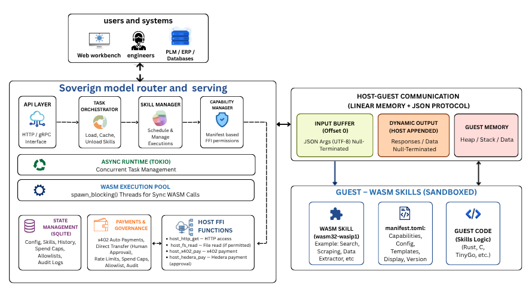

# ARIA — Agentic Interface for AI

ARIA is a local-first, headless agent runtime written in Rust. A ReAct loop drives an LLM
through reasoning and tool calls, executing sandboxed **WASM skills** under a
manifest-declared capability gate, persisting state in SQLite, and exposing a plain
TCP/JSON API on `127.0.0.1:5005`. ARIA also carries a real on-chain `did:hedera`
identity and can move money itself — autonomous **x402** payments and
human-approved direct transfers on Hedera — with every payment decision written to
the Hedera Consensus Service for audit.

This repository is the ARIA monorepo: the daemon, the desktop GUI, and the design docs.



## Architecture at a glance

The diagram above (`Arch.png`) shows the full system:

- **Users and systems** — a web workbench, engineers, and external systems (PLM/ERP/databases) talk to the API layer.
- **Sovereign model router and serving** (the daemon) — the API layer (HTTP/gRPC) feeds a **task orchestrator** (loads, caches, unloads skills), a **skill manager** (schedules and manages executions), and a **capability manager** (manifest-based FFI permissions). Everything runs on an **async runtime (Tokio)** with a **WASM execution pool** (`spawn_blocking` threads for synchronous WASM calls).
- **State and side effects** — **SQLite state management** (config, skills, history, spend caps, allowlists, audit logs), **payments and governance** (x402 auto payments, direct transfer with human approval, rate limits, spend caps, allowlist, audit), and **host FFI functions** (`host_http_*`, `host_fs_*`, `host_x402_pay`, `host_hedera_pay`).
- **Host-guest communication** — a linear-memory + JSON protocol: input buffer at offset 0, host-appended dynamic output, and guest heap/stack/data, all null-terminated.
- **Guest — sandboxed WASM skills** — `wasm32-wasip1` modules (search, scraping, data extraction, …) with a `manifest.toml` declaring capabilities/config/templates, written in Rust, C, TinyGo, and similar.

## Repository layout

| Path | What it is |
| --- | --- |
| [`daemon/`](./daemon) | The headless ARIA daemon (`aria-daemon`): ReAct loop, WASM skill engine, SQLite state, Hedera identity and payments, TCP/JSON API. See [`daemon/README.md`](./daemon/README.md) and [`daemon/ARCHITECTURE.md`](./daemon/ARCHITECTURE.md). |
| [`gui/`](./gui) | The ARIA desktop app: SvelteKit + Tauri. A thin pass-through client that speaks only the daemon's TCP protocol (never touches the daemon's database directly) and keeps its own local session store. |
| [`docs/`](./docs) | Supporting documentation, including [`innovative-skills.md`](./docs/innovative-skills.md). |
| [`proto.md`](./proto.md) | The GUI ↔ daemon protocol: request shape, event stream, and single-shot query/mutate verbs. |
| [`ARIA_v0.6_Design_Doc.md`](./ARIA_v0.6_Design_Doc.md) | Design doc v0.6 — daemon/REPL split, ARIA-as-MCP-server, enterprise model proxy. |
| [`ARIA-v0.55-identity-revision.md`](./ARIA-v0.55-identity-revision.md) | Identity/authorization design — flat personal DIDs, AriaScopeCredential, revocation. |
| [`A-to-A.md`](./A-to-A.md) | Agent-to-agent protocol scope (placeholder — not designed yet). |
| [`Arch.png`](./Arch.png) | The system architecture diagram embedded above. |

## Components

### Daemon

The core host. It runs the LLM ReAct loop, sandboxes and executes WASM skills, enforces
capability and payment governance, keeps an append-only audit chain in SQLite, and
serves a streaming TCP/JSON interface on `127.0.0.1:5005`.

Skills are self-describing WASM modules. Compiled-in and plugin skills include:

- Core: `search.web`, `scrape.web`, `find.fs`, `list.fs`, `read.fs`, `write.fs`, `run.exec`, `write.pdf`, `write.xlsx`, `write.docx`.
- Optional DLT plugin (`daemon/Extra/dlt/`): `x402.pay`, `query.pay`, `transfer.pay`, `chain.query`, `token.create`, `token.mint`, `allowance.set`. Delete the plugin directory and the daemon still builds and runs fully offline.

### GUI

A SvelteKit + Tauri desktop client. It owns no LLM of its own — it forwards turns to the
daemon and renders the streamed events. Screens include Chat, Direct TCP, Dashboard
(spend budget, holds, allowlist, wallet), History (payment and HCS trails), Contracts,
Tokens, and Settings.

## Quick start

Prerequisites: Rust toolchain (via `rustup`), Node.js 18+, and — for the desktop app —
the [Tauri prerequisites](https://tauri.app/start/prerequisites/) for your platform.
Hedera credentials are only needed for identity bootstrap and the DLT features.

Run the daemon:

```bash
cd daemon
cargo build -p aria-daemon
cargo run -p aria-daemon
```

Run the desktop GUI (in a second terminal):

```bash
cd gui
npm install
npm run tauri dev
```

Environment variables for the daemon's Hedera features:

- `HEDERA_ACCOUNT_ID` — operator account, e.g. `0.0.12345`
- `HEDERA_PRIVATE_KEY` — operator ECDSA (secp256k1) private key
- `HEDERA_NETWORK` — `testnet` (default) | `mainnet` | `previewnet`

## Documentation

- GUI ↔ daemon wire protocol: [`proto.md`](./proto.md)
- Daemon architecture and payment-governance flowcharts: [`daemon/ARCHITECTURE.md`](./daemon/ARCHITECTURE.md)
- Identity model: [`ARIA-v0.55-identity-revision.md`](./ARIA-v0.55-identity-revision.md)
- Platform design: [`ARIA_v0.6_Design_Doc.md`](./ARIA_v0.6_Design_Doc.md)

## License

MIT (see [`gui/package.json`](./gui/package.json)).
